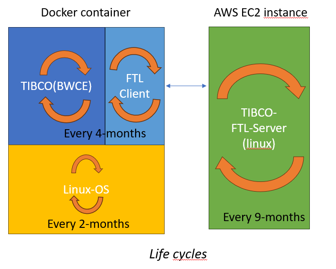

# Welcome to MkDocs

For full documentation visit [mkdocs.org](https://www.mkdocs.org).

## Project layout

    mkdocs.yml    # The configuration file.
    docs/
        index.md  # The documentation homepage.
        ...       # Other markdown pages, images and other files.

## Tutorial  

This is my tutorial..

### images

# Person

## Properties

- **`firstName`** *(string)*: The person's first name.
- **`lastName`** *(string)*: The person's last name.
- **`age`** *(integer)*: Age in years which must be equal to or greater than zero. Minimum: `0`.
